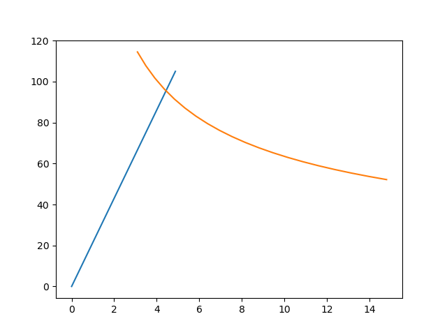
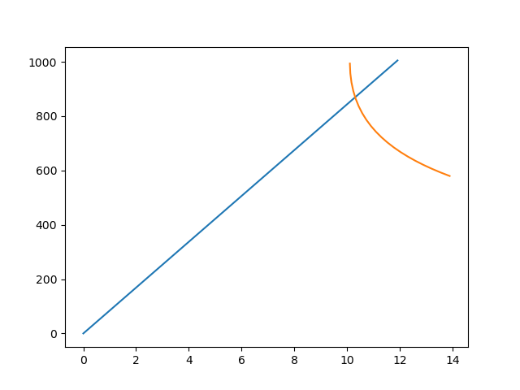
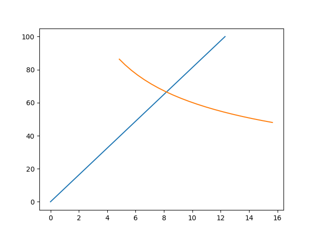
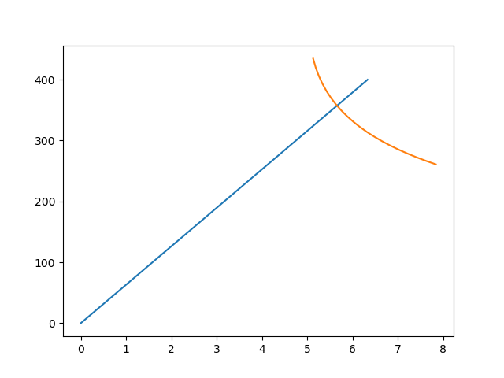

Analytical models
===================

Import the class analyticalModel from purPython module::

    from czmtestkit.purPython import analyticalModel

**DCB**::

    Dcb = analyticalModel()
    Dcb.type = 'DCB'
    Dcb.halfLength = 100*0.5
    Dcb.width = 25
    Dcb.thicknessUpper = 2.4
    Dcb.thicknessCZ = 0.2
    Dcb.intialCrack = 60
    Dcb.maxLoadElastic = 105
    Dcb.crackLenStart = 50
    Dcb.crackLenStop = 110
    Dcb.materialProp = [109000, 8819, 8819, 0.34, 0.34, 0.38, 4315, 4315, 3200]
    Dcb.fractureToughness = 0.42
    Dcb.name = 'DCB_1017_001'
    Dcb.generate()

   Load vs displacement plot for DCB test.

**ENF**::

    Enf = analyticalModel()
    Enf.type = 'ENF'
    Enf.halfLength = 200*0.5
    Enf.width = 25
    Enf.thicknessUpper = 2.4
    Enf.thicknessCZ = 0.2
    Enf.intialCrack = 80
    Enf.maxLoadElastic = 1005
    Enf.crackLenStart = 70
    Enf.crackLenStop = 120
    Enf.materialProp = [109000, 8819, 8819, 0.34, 0.34, 0.38, 4315, 4315, 3200]
    Enf.fractureToughness = 2.89
    Enf.name = 'ENF_1017_001'
    Enf.generate()

   Load vs displacement plot for ENF test.

**ADCB**::

    Adcb = analyticalModel()
    Adcb.type = 'ADCB'
    Adcb.halfLength = 100*0.5
    Adcb.width = 25
    Adcb.thicknessUpper = 1.5
    Adcb.thicknessLower = 5.1
    Adcb.thicknessCZ = 0.2
    Adcb.intialCrack = 65
    Adcb.maxLoadElastic = 100
    Adcb.crackLenStart = 50
    Adcb.crackLenStop = 90
    Adcb.materialProp = [109000, 8819, 8819, 0.34, 0.34, 0.38, 4315, 4315, 3200]
    Adcb.fractureToughness = 0.50
    Adcb.name = 'ADCB_1017_001'
    Adcb.generate()

   Load vs displacement plot for ADCB test.

**SLB**::

    Slb = analyticalModel()
    Slb.type = 'SLB'
    Slb.halfLength = 200*0.5
    Slb.width = 25
    Slb.thicknessUpper = 2.4
    Slb.thicknessCZ = 0.2
    Slb.intialCrack = 73
    Slb.maxLoadElastic = 400
    Slb.crackLenStart = 60
    Slb.crackLenStop = 100
    Slb.materialProp = [109000, 8819, 8819, 0.34, 0.34, 0.38, 4315, 4315, 3200]
    Slb.fractureToughness = 0.95
    Slb.name = 'SLB_1017_001'
    Slb.generate()

   Load vs displacement plot for ASLB test.

Files corresponding to the analytical models can be found in ``TestDirectory\Analytical\`` directory in the parent repository.

**Database**

It is easier to manage the tests by creating a database of the input. 
For example, one could add the class attributes of an instance to a `.json` file::

    import json

    with open('Database.json','a') as file:
        json.dump(instance.__dict__, file)
        file.write('\n')