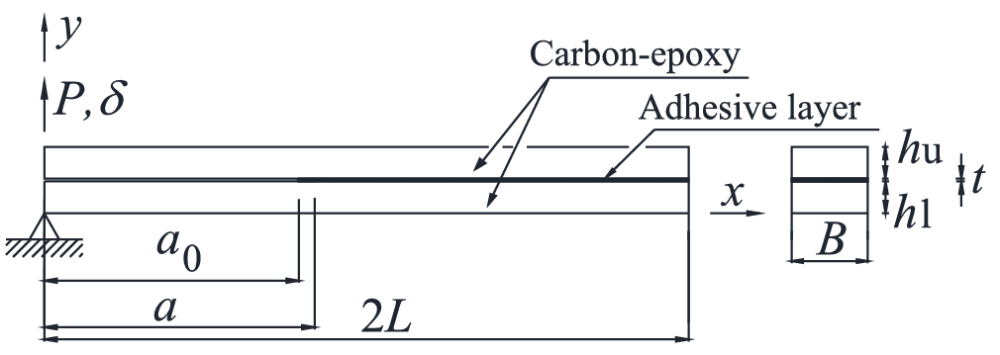
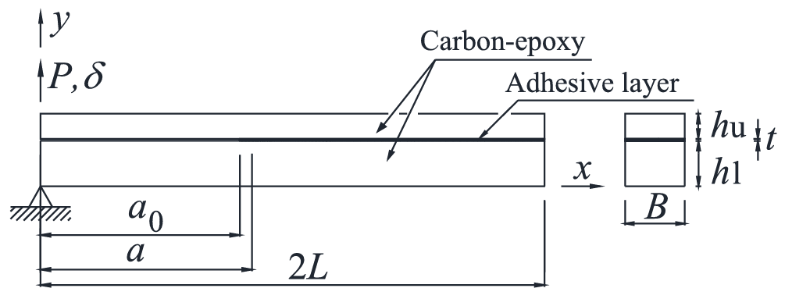
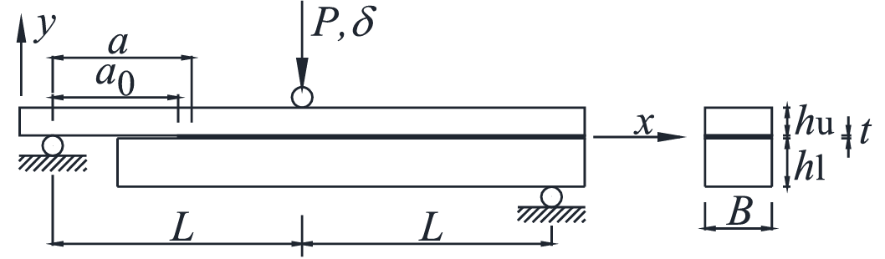
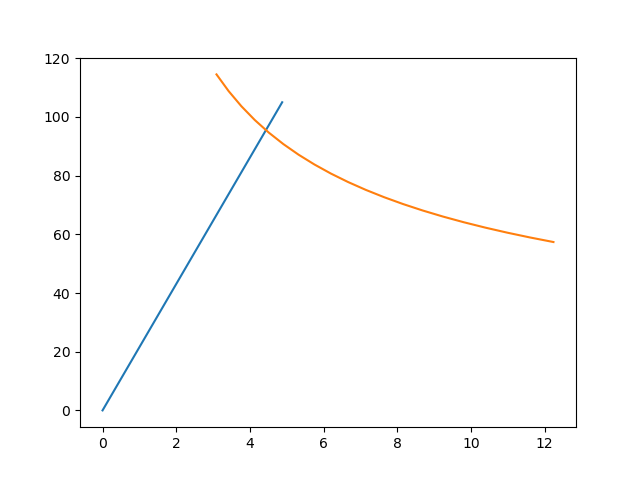
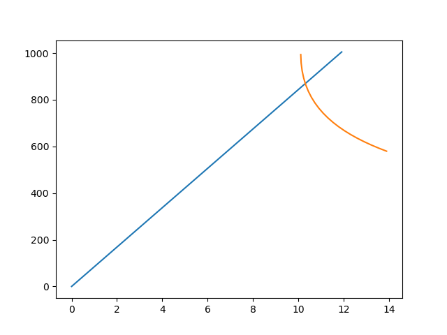
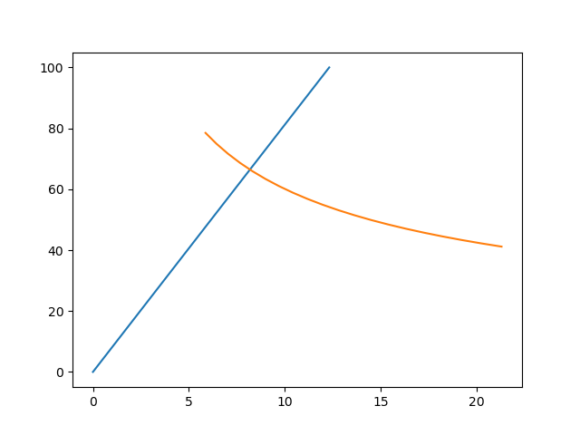
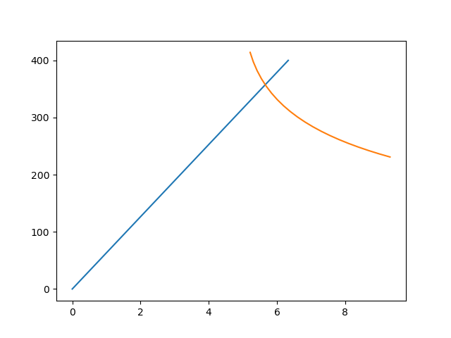

Analytical models
===================

Import the class analyticalModel from purPython module::

    from czmtestkit.purPython import analyticalModel
    from czmtestkit import testModel

Then input corresponding model properties to ``testModel`` class.

DCB::

    Dcb = testModel()
    Dcb.type = 'DCB'
    Dcb.lenTop = 100
    Dcb.width = 25
    Dcb.thickTop = 2.4
    Dcb.thickBot = 2.4
    Dcb.thickCz = 0.2
    Dcb.crack = 60
    Dcb.peakLoad = 105
    Dcb.matPropTop = [109000, 8819, 8819, 0.34, 0.34, 0.38, 4315, 4315, 3200]
    Dcb.fTough = 0.42
    Dcb.name = 'DCB_1017_001'

   Example DCB specimen.

ENF::

    Enf = testModel()
    Enf.type = 'ENF'
    Enf.lenTop = 200
    Enf.width = 25
    Enf.thickTop = 2.4
    Enf.thickCz  = 0.2
    Enf.crack = 80
    Enf.peakLoad = 1005
    Enf.matPropTop = [109000, 8819, 8819, 0.34, 0.34, 0.38, 4315, 4315, 3200]
    Enf.fTough = 2.89
    Enf.name = 'ENF_1017_001'

   Example ENF specimen.

ADCB::

    Adcb = testModel()
    Adcb.type = 'ADCB'
    Adcb.lenTop = 100
    Adcb.width = 25
    Adcb.thickTop = 1.5
    Adcb.thickBot = 5.1
    Adcb.thickCz = 0.2
    Adcb.crack= 65
    Adcb.peakLoad = 100
    Adcb.matPropTop = [109000, 8819, 8819, 0.34, 0.34, 0.38, 4315, 4315, 3200]
    Adcb.fTough = 0.50
    Adcb.name = 'ADCB_1017_001'

   Example ADCB specimen.

SLB::

    Slb = testModel()
    Slb.type = 'SLB'
    Slb.lenTop = 200
    Slb.width = 25
    Slb.thickTop = 2.4
    Slb.thickCz = 0.2
    Slb.crack = 73
    Slb.peakLoad = 400
    Slb.matPropTop = [109000, 8819, 8819, 0.34, 0.34, 0.38, 4315, 4315, 3200]
    Slb.fTough = 0.95
    Slb.name = 'SLB_1017_001'

   Example SLB specimen.

Further, add the model properties to a database for future reference. 
``testModel`` class a funciton ``addToDatabase`` that does this job for you. ::

    Dcb.addToDatabase('Input.json')
    Enf.addToDatabase('Input.json')
    Adcb.addToDatabase('Input.json')
    Slb.addToDatabase('Input.json')

If no argument is passed to the function ``addToDatabase``, it will create a file named ``<JobName>_in.json`` and dump your properties there.

Now these class attributes can be passed to ``analyticalModel`` class.
This class will inherit the attributes and calculates paramters required to generate the analytical results.
Finally using the ``generate`` function you can obtain the analytical results::

    a1 = analyticalModel(Dcb)
    a1.generate()
    a2 = analyticalModel(Enf)
    a2.generate()
    a3 = analyticalModel(Adcb)
    a3.generate()
    a4 = analyticalModel(Slb)
    a4.generate()

Files from these example tests and the source code are available in ``<Path to CzmAbqUel>\TestDirectory\<Test Type>`` directory.
Following are the plots generated by the code presented.

   Load vs displacement plot for DCB test.

   Load vs displacement plot for ENF test.

   Load vs displacement plot for ADCB test.

   Load vs displacement plot for ASLB test.