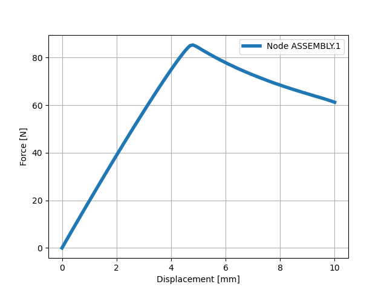

Finite Element Simulations
==========================

You will need the following modules to run finite element simulations::
    
    import czmtestkit as ctk
    import czmtestkit.purPython as pPy

Following sections present sample codes to run some standardized tests.

Double Cantilever Beam
----------------------

Double cantilever beam test is a tension type fracture specimen used to characterize the mode-I interface behaviour. 

.. figure:: DCB_Specimen.png
   :width: 50 %
   :alt: Example DCB specimen

   Example DCB specimen.

To run this test, generate an instance of ``testModel`` and assign required properties::

	t = ctk.testModel()
	t.type = 'DCB' # Model type
	t.lenTop = 100 # Length of top substrate
	t.lenBot = 100 # Length of bottom substrate
	t.width = 25 # Width of the Model
	t.thickTop = 2.4 # Thickness of top substrate
	t.thickBot = 2.4 # Thickness of bottom substrate
	t.thickCz = 0.2 # Thickness of the cohesive zone
	t.crack = 60 # crack length 
	t.loadE1 = 0 # loading edge 1
	t.loadE2 = 0 # loading edge 2 
	t.stepTime = 1 # Total step time
	t.uFactor = 2 # Multiplier for displacement in force displacement curve
	t.UvsRFplot = True # force displacement plot
	t.BC = [0,0,5] # Displacement boundary condition on the load edge/face
	t.matTypeCz = 'AbqMatLib'
	t.matPropCz = [1000000, 18, 18*((2.89/0.42)**0.5), 0.42, 2.89, 2.35] # List of material properties of the cohesive zone
	t.matTypeTop = "AnIso"
	t.matPropTop = [109000, 8819, 8819, 0.34, 0.34, 0.38, 4315, 4315, 3200] # Anisotropic elastic material properties
	t.matTypeBot = "AnIso"
	t.matPropBot = [109000, 8819, 8819, 0.34, 0.34, 0.38, 4315, 4315, 3200] # Anisotropic elastic material properties
	t.TabPosition = 1
	t.nCpu = 7
	t.nGpu = 1
	t.meshSeed = [0.1, 5, 0.6]
	t.crackSeed = 5
	t.name = 'Name'

Save the attributes to a database::

	t.addToDatabase()

Using the data base you can now run finite element simulation::

	# Generating the cae model and running the simulation
	ctk.abqFun(t.name+"_in.json", 'withBulk')

.. Warning:: You need to have abaqus installed and accessble by the command ``abaqus`` for the function to work.

.. Note:: If you use a custom name when creating the database make sure to pass the same to the function. ``ctk.abqFun('<custom name>', '<function name>')``

Similarly you can also retrive the history output. 
`withBulk` simulation has reaction force and displacement at the loading edge requested as history output.
This can be extracted and saved to file named ``<t.name>_Raw.csv`` using the following code:: 

	# Reading history output
	ctk.abqFun(t.name+"_in.json", 'hisOutLoadPoint')

Further, you can process the data and plot the force vs displacement curve using::

	pPy.UvsRF(t)

   Example load vs displacement plot for DCB test.

Abaqus generates files when running simulations. Incase these are not required you can use the ``cleanUp`` function::

	pPy.cleanUp(saveExt=[])

This function by default cleans all the files in the current working directory except files with ``.txt``, ``.json``, ``.png`` or ``.csv`` extensions. 
You can add extensions to be excluded from being removed by adding to the ``saveExt`` list.
For example is you want to keep the python scripts with extension ``.py`` you can use the command ``pPy.cleanUp(saveExt=['py'])``.

Files from such example tests and the source codes are available in ``<Path to CzmAbqUel>\TestDirectory\<Test Type>`` directory.