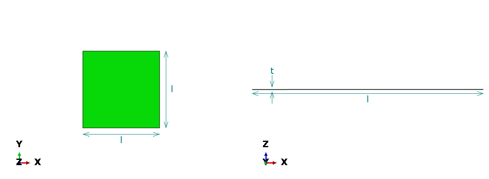
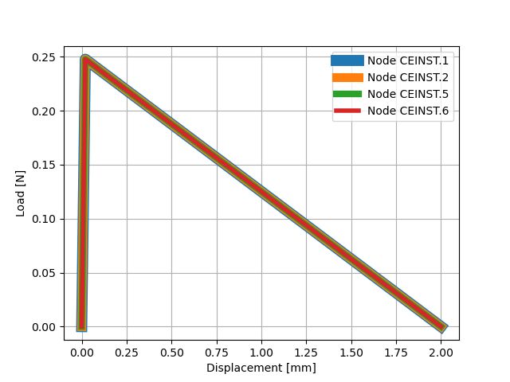
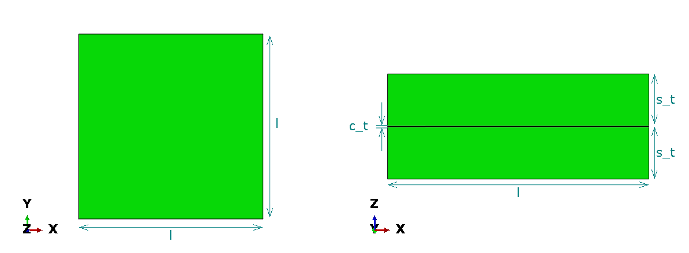
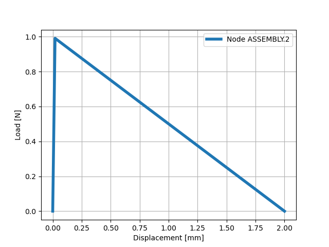

Single element test
===================

First we go over scripts to test single element defined as a cohesive zone element modeled using cohesive zone implementation from abaqus library.
Run the following abaqus python script in cae kernal.

.. literalinclude:: ../../../TestDirectory/Example1/AbqScript.py
   :language: python

This can be done using abaqus PDE, from the cae kernal or by command line interface.
The script saved in AbqScript.py can be called from command prompt or shell using the following command::
 
    $ abaqus cae noGUI=AbqScript.py

This defines, executes and extracts the required data from abaqus files. 
The code used default funcion arguments which defines a unit square of 0.001 thickness under mode-1 load:

   
   Profile views of single cohesive element of length **l** and thickness **t**.

The results can then be extracted using the following script.

.. literalinclude:: ../../../TestDirectory/Example1/PyScript.py
   :language: python

To execture this activate CZ environment and execute the python script::

    $ conda activate CZ
    $ python PyScript.py

Raw extracted by the abqPython module is then processed and saved to ``Results.csv``. 
A plot using the data is generated and saved as ``UvsRF.pdf`` as well:

   Load vs displacement plot

Files corresponding to this test can be found in ``TestDirectory\Example1\`` directory in the parent repository

Testing a user subroutine
-------------------------

Modifying the AbqScript to the script shown below, user subroutines can be implemented with ease.

.. literalinclude:: ../../../TestDirectory/Example2/AbqScript.py
   :language: python

Running this AbqScript and PyScript as earlier results in the following plot:

   Load vs displacement 

Files corresponding to this test can be found in ``TestDirectory\Example2\`` directory in the parent repository

The user subroutine ``IDF.for`` used results in the same solution as abaqus linear softening implementation.
The fortran code is available in the TestDirectory for now. 
It will be documented and included in the package in the future.

Single element tied to substrates
---------------------------------

A single element model similar to the one presented above can be generated with substrates tied to the top and bottom faces can be generated using the function NonStdWithSub().
Script below is an example for such model.

.. literalinclude:: ../../../TestDirectory/Example4/AbqScript.py
   :language: python

The script generates and uses the following model:

   
   Profile views of single cohesive element of length **l** and thickness **c_t** tied to substrates of thickness **s_t**.

For mode-1 load case the simulation results in load displacement plot similar to the cases mentioned above:

   Load vs displacement plot

Files corresponding to this test can be found in ``TestDirectory\Example4\`` directory in the parent repository 